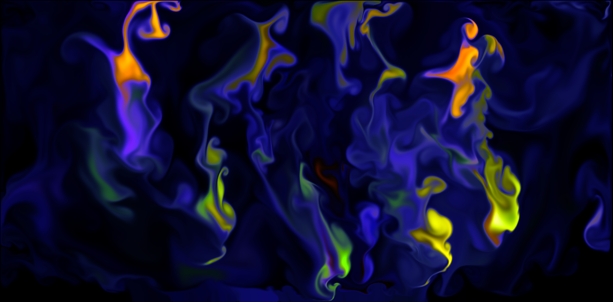

# GPU Fluid Simulation

WebGL based 2D Real-Time Fluid Simulation with THREE.js. This implementation is based on GPU Gems article [Fast Fluid Dynamics Simulation on the GPU]( https://developer.download.nvidia.com/books/HTML/gpugems/gpugems_ch38.html) by Mark Harris. This codebase was adapted from https://arsh-khokhar.github.io/GPU-Fluid-Simulator/ underneath the creative commons license from Arsh Khokar. 

